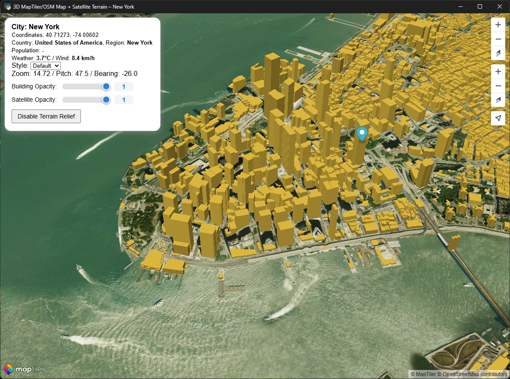
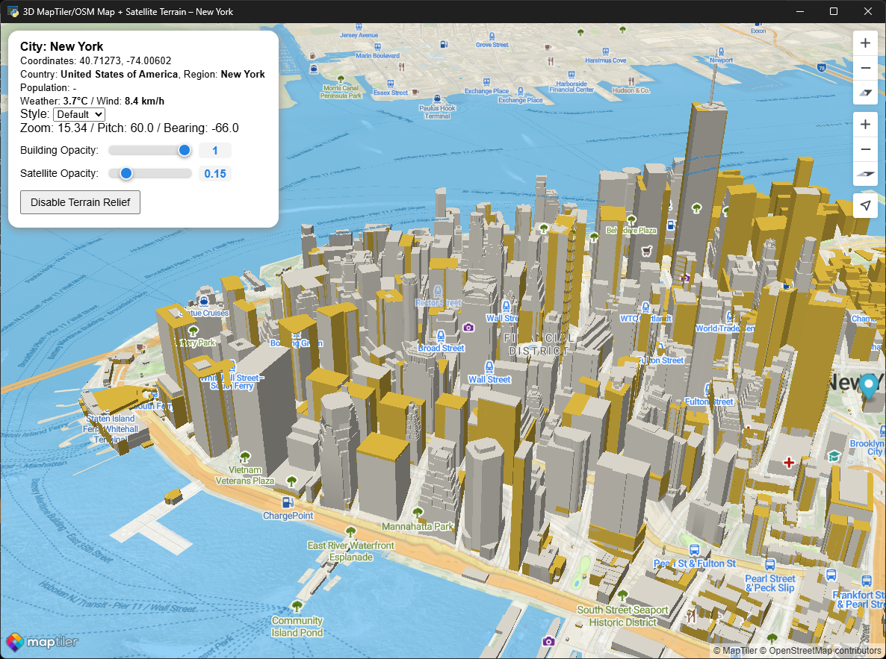
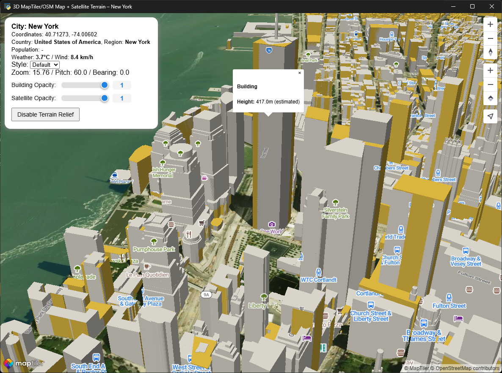
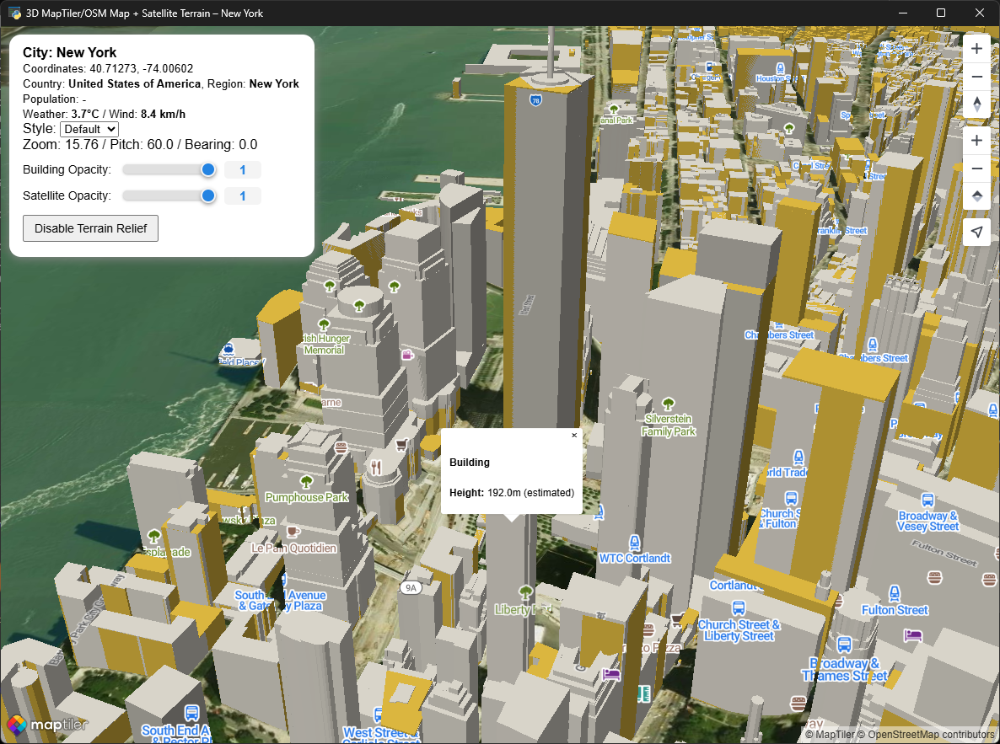
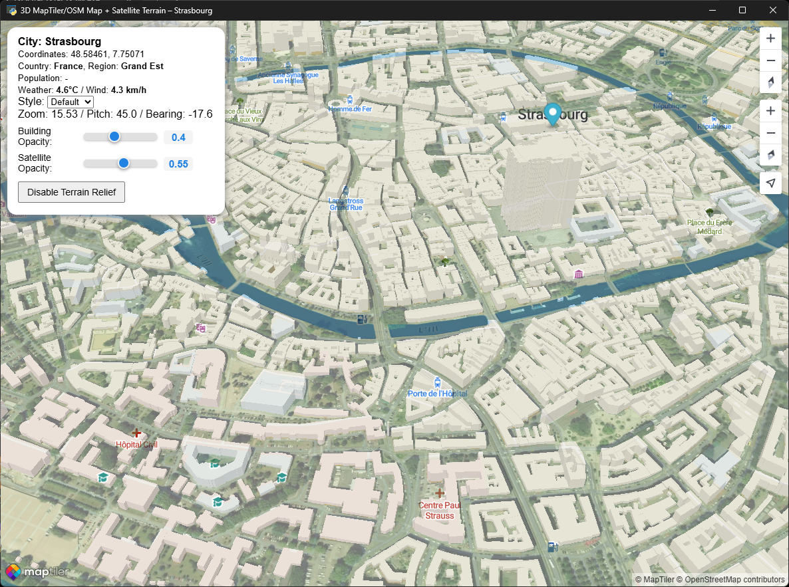
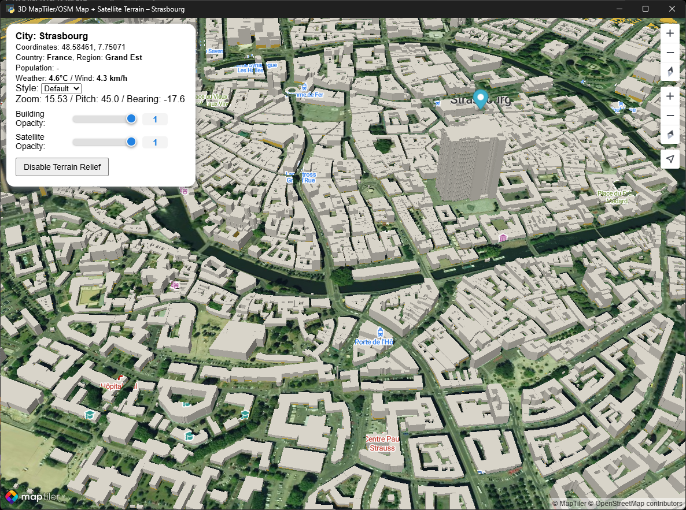
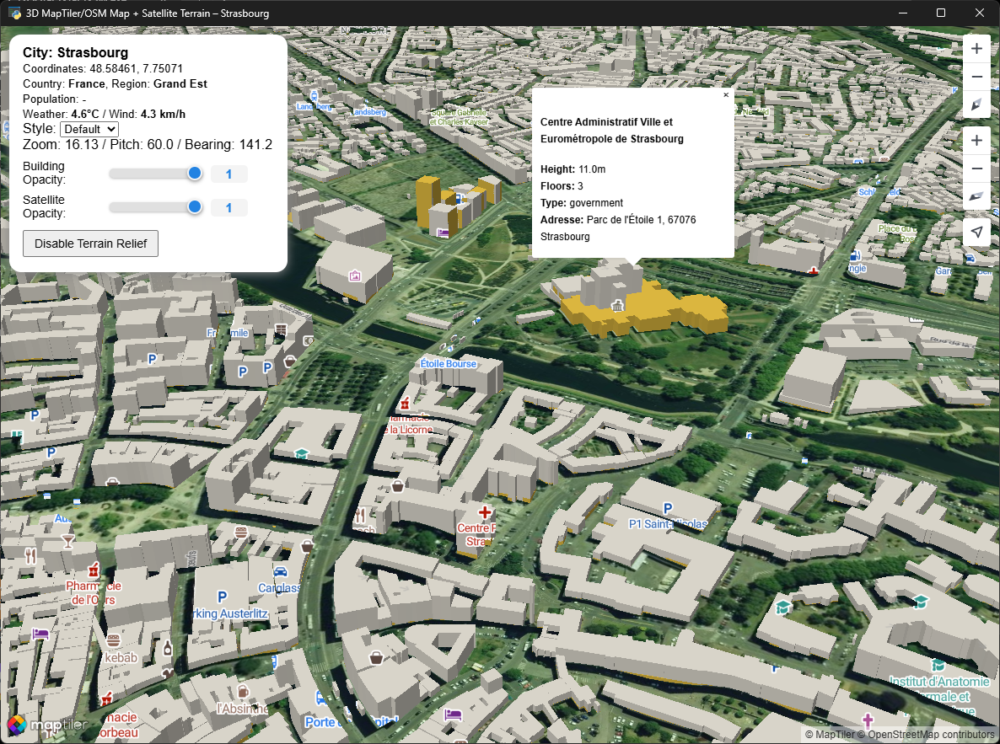

# *3D City Map Viewer with OSM & MapTiler Integration*

## *Descriptions*

This project provides an interactive 3D map viewer for any city, leveraging OpenStreetMap (OSM), MapTiler API,
and real-time public data sources for a rich visualization experience. The main features include:

- **City Selection**: Choose any city to display its buildings in 3D using a MapTiler/webview interface.
- **Automatic Data Retrieval**:
  - Geographic coordinates and basic location info via [Nominatim](https://nominatim.openstreetmap.org/).
  - Population statistics using Wikidata and GeoNames.
  - Latest weather and wind info from Open-Meteo.
- **Building Extraction**: Optionally extracts OSM building geometries for the chosen city with the Overpass API, and saves them in a local GeoJSON cache.
- **Customizable Map Styles**: Switch between different map themes (streets, satellite, dark, winter, basic) directly in the viewer.
- **3D Visualization**: Buildings are rendered as 3D extrusions for enhanced city exploration.
- **Opacity Controls**: Adjust the transparency of buildings and satellite layers for optimal clarity.
- **Terrain Relief Toggle**: Enable/disable terrain elevation overlay for satellite imagery.
- **Interactive Tooltips**: Click on buildings for info (height, building type, levels) or roads for names.
- **Cross-platform GUI**: Runs inside a Python webview window, with auto-generation of a local HTML file tailored to your selected city and API key.

Additional flags allow city selection, OSM data extraction, and cache management.

**Typical Applications**:
- Urban simulation and visualization
- Geographic and weather data exploration
- Quick city info dashboards

## *Screenshot of my Applications*

## I will add other tools in the future...

 
